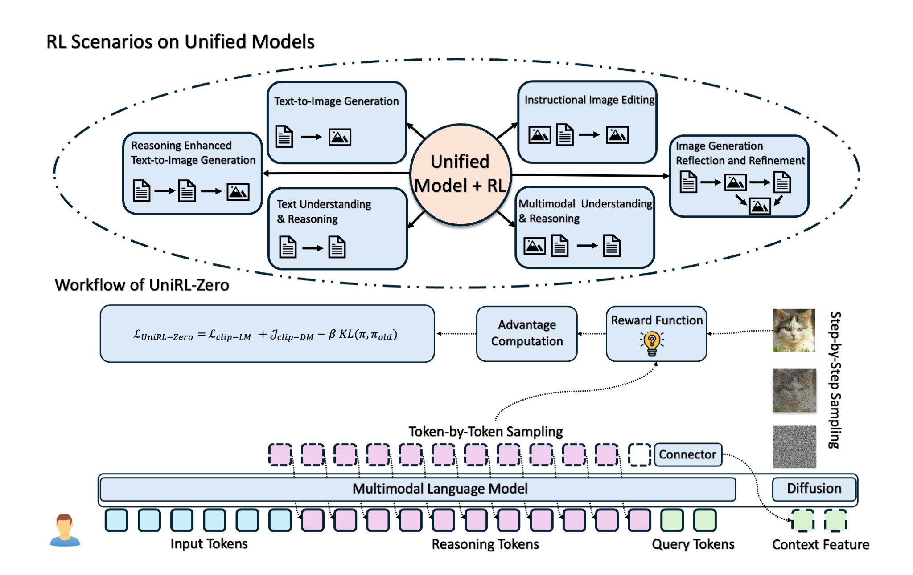

# 🌟 UniRL Project: Unleashing Reinforcement Learning Power on Joint Langue Model and Diffusion Model! 🚀

## Overview

Welcome to the **UniRL** project, where we supercharge reinforcement learning with joint diffusion model and language model experts with a user-friendly, lightweight codebase! 🎉 Ready to jump in? 🧙‍♂️

Our mission is to enable seamless joint training of language models and diffusion models for reinforcement learning. UniRL might supports a diverse range of powerful pretrained models, including language models (Qwen, Qwen-VL), diffusion models (Flux-dev, Flux-Kontext, Stable Diffusion, SANA), and unified models (MetaQuery, Blip3o).

<div align="center">
  
</div>

## News

- [2025-10-20]⭐️: Release the initial version code and report of project `UniRL`.


## Installation 🛠️

### Environment Setup

Follow these steps to get started:

1. **Create the Conda Environment** 🌍:

   ```bash
   conda env create -f environment.yml
   ```

2. **Install CLIP** 🖼️:

   ```bash
   pip install git+https://github.com/openai/CLIP.git
   ```

3. **Install Diffusers** 🎨:

   ```bash
   git clone https://github.com/huggingface/diffusers.git
   cd diffusers
   pip install -e .
   cd ..
   ```

4. **Install Flash Attention** ⚡️:

   ```bash
   pip install flash-attn==2.7.4.post1 --no-build-isolation
   ```

5. **Activate the Environment** 🚀:

   ```bash
   conda activate unirl
   ```

6. **Install Reward Services** 😊:
   ```bash
   cd rewards_services/api_services
   
   
   # install the environments of api services independently following the readme files.
   # take aesthetic score as an example:
   
   
   cd aesthetic_scorer_service
   conda create -n aes python=3.10 -y
   conda activate aes
   pip install -r requirements.txt
   bash run.sh
   ```

   After lanuching all the reward services, please modify the `[NODE_ADDR]` (in `unirl/reward_evaluator/reward_evaluator.py`, `unirl/trainer/grpo_pmatters_trainer.py`) as the address of the reward service machine. 

### Custom DeepSpeed Modification 🔧

We  patched the `TorchCheckpointEngine` in DeepSpeed to address a bug that was preventing training resumption. Our fix? Adding `weights_only=False` to the `torch.load` function in the `load` method. This ensures you can resume training without a hitch! 💪

The modified file is located at:

```
[PATH TO MINICONDA]/miniconda3/envs/unirl/lib/python3.11/site-packages/deepspeed/runtime/checkpoint_engine/torch_checkpoint_engine.py
```

Here's the updated code:

```python
class TorchCheckpointEngine(CheckpointEngine):
    ....
	
    def load(self, path: str, map_location=None):
        logger.info(f"[Torch] Loading checkpoint from {path}...")
        # partition = torch.load(path, map_location=map_location)
        partition = torch.load(path, map_location=map_location, weights_only=False)
        logger.info(f"[Torch] Loaded checkpoint from {path}.")
        return partition
    ...
```

## Project Content 📜

The UniRL project encompasses the following key components:

1. **Pretraining of Unified Understanding and Generation Models**: We develop and pretrain models that integrate multimodal understanding and generative capabilities, enabling robust feature representation and high-quality content generation across diverse tasks.🧠
2. **Reinforcement Learning on Unified Models**: We implement reinforcement learning algorithms tailored for unified understanding and generation models, optimizing policies for enhanced decision-making and performance in complex environments.⚙️
3. **Joint Reinforcement Learning with Pretrained Models**: UniRL supports joint reinforcement learning with pretrained large language models (e.g., Qwen, QwenVL) and diffusion models (e.g., Stable Diffusion 3, FLUX, FLUX-Kontext, SANA), facilitating advanced, multimodal policy training and evaluation.✨

## Usage 🚀

1. Set up the environment as outlined above.

2. Activate the `unirl` environment:

   ```bash
   conda activate unirl
   ```

3. Run your experiments and enjoy seamless training! 😎

   For pretraining the base unified understanding and generation model,

   ```bash
   bash UniRL/scripts/train/pretrain/train.sh
   ```
   which will automatically download the model weights and datasets.

   For RL training,

   ```bash
   bash UniRL/scripts/train/rl/train_blip3o_[setting_name].sh
   ```
   Please correctly set up the setting name and WANDB_KEY in the `train_blip3o_[setting_name].sh` file. 


4. Inference 

   Download pretrained models weights: 

   

   For image generation inference:
   ```bash
   python -m scripts.inference.inference_blip3o_t2i
   ```

   For image editing inference:
   ```bash
   python -m scripts.inference.inference_blip3o_i2i
   ```


## Contributing 🤝

Got ideas to make UniRL even better? Submit a pull request or open an issue to join the fun! We love community contributions. 🌈

## License 📝

This project is licensed under the Apache-2.0 License. See the `LICENSE` file for details.

## Also Read 📚


Check out these amazing related works to explore more in reinforcement learning and generative models:

- **GRPO**: [DeepSeekMath: Pushing the Limits of Mathematical Reasoning in Open Language Models](https://arxiv.org/abs/2402.03300)
- **ReMax**:  [ReMax: A Simple, Effective, and Efficient Reinforcement Learning Method for Aligning Large Language Models](https://arxiv.org/abs/2310.10505)
- **RLOO**: [Back to Basics: Revisiting REINFORCE Style Optimization for Learning from Human Feedback in LLMs](https://arxiv.org/abs/2402.14740)
- **Flow-GRPO**: [Flow-GRPO: Training Flow Matching Models via Online RL](https://arxiv.org/abs/2505.05470)
- **DanceGRPO**: [DanceGRPO: Unleashing GRPO on Visual Generation](https://arxiv.org/abs/2505.07818)

